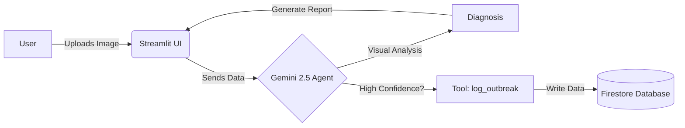

# 🌿 AgriDoc: Intelligent Plant Pathology Agent

> **A Serverless, Multimodal AI Agent that diagnoses plant diseases, suggests organic remedies, and autonomously monitors outbreaks using Google Cloud.**


---

## 📖 Overview

**AgriDoc** is not just a chatbot—it is an **AI Agent**. It uses Google's **Gemini 2.5 Flash** model to "see" plant diseases through uploaded photos. Unlike standard apps, it employs an **Agentic Workflow** with the **Model Context Protocol (MCP)** concept:

1.  **Visual Analysis:** Diagnoses diseases from images with high accuracy.
2.  **Autonomous Decision Making:** The Agent *decides* whether a disease is severe enough to log.
3.  **Tool Use:** If confidence > 70%, it autonomously calls a `log_outbreak` tool to write data to **Cloud Firestore**.
4.  **Multilingual & Actionable:** Provides remedies in local languages and generates PDF prescriptions.

---

## 🏗️ Architecture

This project follows a **Modular Monolith** architecture deployed on **Google Cloud Run**.



- Frontend: Streamlit (Python)
- Brain: Vertex AI / Google Generative AI (Gemini 2.5 Flash)
- Memory: Google Cloud Firestore (Native Mode)
- Compute: Google Cloud Run (Serverless)


## ✨ Key Features
- 🌱 Instant Diagnosis: Identifies 300+ plant diseases from a single photo.
- 🧠 Agentic Workflow: The AI autonomously decides when to update the national registry.
- 🌍 Multilingual Support: diagnosis available in English, Hindi, Spanish, and Telugu.
- 📄 Digital Prescriptions: Auto-generates downloadable PDF reports for farmers.
- 📊 Outbreak Monitor: Real-time dashboard tracking confirmed disease cases.

## 🚀 Getting Started
### Prerequisites
- Google Cloud Account with billing enabled (or free trial).
- Google Cloud CLI installed.
- Google AI Studio API Key (or Vertex AI permissions).
- Python 3.9+ installed locally.

1. Clone the Repository
```bash
git clone [https://github.com/your-username/agridoc-enterprise.git](https://github.com/your-username/agridoc-enterprise.git)
cd agridoc-enterprise
```

2. Environment Configuration
Create a .env file in the root directory to store your secrets safely:

```bash
touch .env
```

Open .env and add your keys:
```bash
# Your Google Cloud Project ID
GOOGLE_CLOUD_PROJECT=your-project-id

# Your Google AI Studio API Key (Get it from aistudio.google.com)
GOOGLE_API_KEY=your-api-key-here

# Region for Cloud Run (Recommended: us-central1 or asia-south1)
GOOGLE_CLOUD_REGION=asia-south1
```

3. Install Dependencies
```bash
pip install -r requirements.txt
```

4. Run Locally
Start the Streamlit server:

```bash
streamlit run app.py
```
Access the app at http://localhost:8501.

## ☁️ Deployment (Google Cloud Run)
Deploy the entire application to the cloud in a single command.

1. Enable Required APIs:

```bash
gcloud services enable aiplatform.googleapis.com firestore.googleapis.com run.googleapis.com
```

2. Create Firestore Database: Ensure you have a Firestore database created in Native Mode via the Google Cloud Console.
3. Deploy: Replace [YOUR_API_KEY] with your actual key.
```bash
   gcloud run deploy agridoc-pro \
  --source . \
  --region asia-south1 \
  --allow-unauthenticated \
  --set-env-vars GOOGLE_CLOUD_PROJECT=$(gcloud config get-value project) \
  --set-env-vars GOOGLE_API_KEY="[YOUR_ACTUAL_API_KEY_HERE]"
```

## 📂 Project Structure
```bash
agridoc-enterprise/
├── app.py               # Main Application (Streamlit UI)
├── requirements.txt     # Python Dependencies
├── Dockerfile           # Cloud Run Configuration
├── .env                 # Local Environment Variables (Ignored by Git)
└── src/
    ├── __init__.py
    ├── agent.py         # The AI Brain (Gemini + Tool Definitions)
    ├── database.py      # Firestore Connection Logic (The Tool)
    └── config.py        # Configuration Management
```

## Troubleshooting
- System Init Failure: Check if your GOOGLE_API_KEY is correct in the .env file or Cloud Run environment variables.
- Firestore Error: Ensure your database is in Native Mode, not Datastore Mode.
- Quota Exceeded: If Gemini 2.5 Flash is busy, try switching MODEL_NAME in src/config.py to gemini-2.0-flash.
